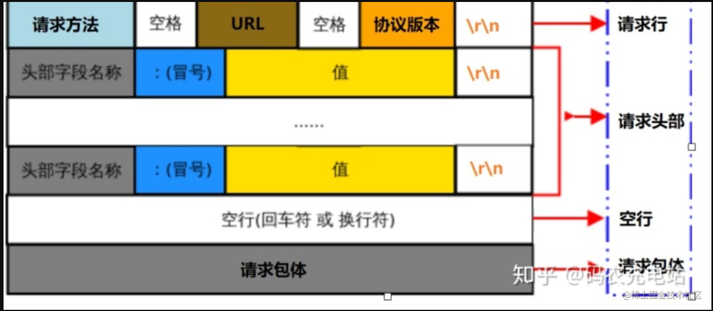
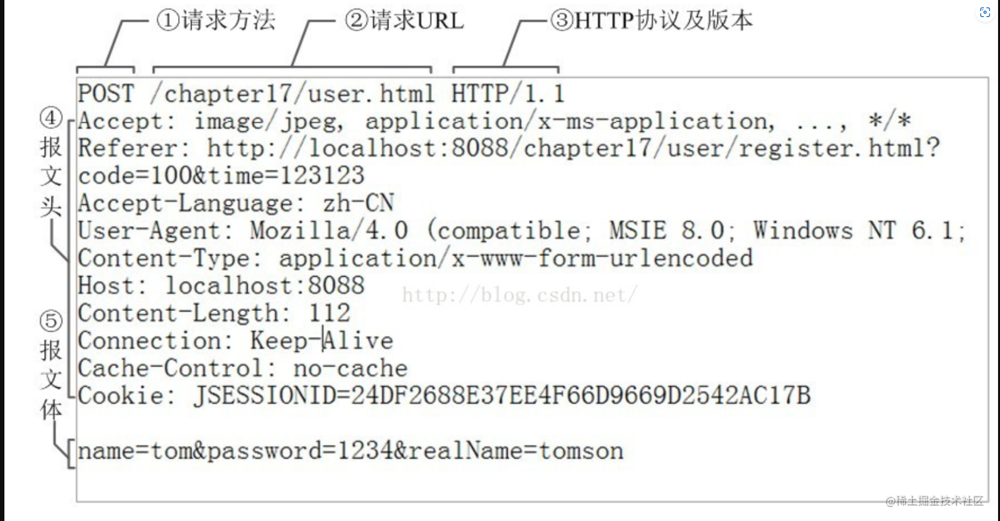
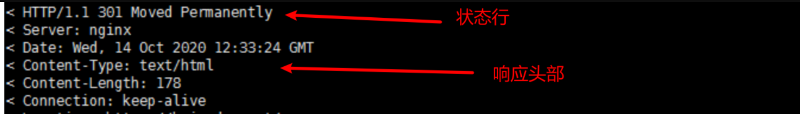

## 基于NIO回调函数的HTTP协议解析

本示例实现了一个基于HTTP协议的文件服务器,具体的文件服务逻辑的实现此处文档不会过多赘述,过程也很简单,大家可以自己查看源代码理解.

本文档讲解如何如何基于NIO回调实现对HTTP协议的解析.

### 基于回调的解析需要保存上下文

在正式解析HTTP协议之前,我们应该清楚,基于回调的解析过程和普通的BIO阻塞式的流程是有很大不同的.

基于回调的逻辑是会不连续的,只会在对应的时机触发回调,而回调触发后并不确保数据收到的完整性,且本次回调触发后,该解析相关的资源都会被释放(取决于资源的生命周期).

但基于BIO的阻塞式的逻辑一定是连续的,如果读取的数据没有准备好,那么是会一直阻塞的,你解析数据的上下文也是一直都存在的,只要停止阻塞就能立马恢复解析.

经过论述,基于回调的解析过程是一定要妥善保管好上下文,至少不能产生下面这几点:

1. 资源生命周期太短,每次触发回调一结束资源就释放了.
2. 资源不应该多个线程共享,否则就会产生线程安全问题.

其实也很好解决这两个问题,我们只需要在每个连接类中添加一个可以设置上下文的方法即可,那么这个上下文和连接类的生命周期是一样长的,而且每个连接单独有一份资源,也不会产生资源的共享.

而这个上下文应该满足存储任意类型,那么 `std::any` 正好合适.

### 关于HTTP协议

大家先看一下HTTP协议的请求报文以及响应报文的样子:

* **请求报文**
  
  

* **响应报文**
  
  


其实HTTP协议报文的设计是很巧妙的,我们总结下需要注意的地方:

1. 通过 `\r\n` 进行整个字段的划分,第一次 `\r\n` 是请求行/状态行的结尾,后面的都是头部的结尾,如果出现单独的 `\r\n` 那么表示整个请求头的结束,下面接收的应该是请求/响应体.
2. 在发送请求/响应体的时候,需要通过头部字段 `Content-Length` 来指定接下来的长度,否则无法解析请求/响应体,在 HTTP1.1 协议中还支持分块传输,那么可以通过头字段 `Transfer-Encoding: chunked` 来指定需要分块,那么请求/响应体可以分成多块进行传输,但是需要在每块前面先发送一行长度,具体感兴趣的可以看看[博客](https://www.dazhuanlan.com/klovers/topics/1373979).
3. HTTP协议中浏览器认定本次数据接收完成的认定也是非常的重要,如果有响应体,那么讲需要像 `2` 中的处理方式一样,但是请注意,如果没有带上 `Connection: close` 浏览器还是会一直转圈认为数据没有接收完(HTTP1.1及以下版本),也就是说如果是最后一个响应报文了,那么请带上 `Connection: close` 头字段.

除了上述几点需要注意以外,我还发现浏览器下面的特殊行为:

> 普通的 `Connection: close`  字段只是能够防止浏览器前端转圈,其实并没有真正关闭该连接,后续还是复用的同一个连接,后端通过shutdown关闭了写或者close关闭了读和写,这个时候浏览器端才会正真关闭这个tcp连接,这点的验证过程我是通过观察postman的延迟发现的,如果我不shutdown每次收发数据的延迟都差不多几毫秒(除了第一次建立连接的时候十几毫秒),但是如果shutdown了,那么每次收发都是十几毫秒. 而且如果你shutdown了即便没有 `Connection: close` 字段,浏览器的前端也不会再转圈了.

上述需要注意的点除了第一点以外都是与HTTP报文解析无关的,是HTTP协议的具体内容,本文只阐述HTTP协议的解析过程,讲这些点只是为了让大家能够看懂完整的源代码.

### 源码实现

通过前面知识的铺垫,我们可以开始编写对应的源代码了.

把整个解析过程分解四个状态的状态机:

* `kExpectRequestLine` : 需要解析请求行的状态
* `kExpectHeaders` : 需要解析请求头的状态
* `kExpectBody` : 需要解析请求体的状态
* `kGotAll` : 已经解析完一个完整报文的状态

1. 解析过程源码:

   ```cpp
   bool http::Context::processRequestLine(const netpoll::StringView &text)
   {
      StrView sv   = text;
      // set method
      size_t  next = sv.find(' ');
      if (next == std::string::npos) return false;
      if (auto method = Request::MethodMapping({text.data(), next});
          method != Method::kInvalid)
      {
         request_.method() = method;
      }
      else return false;
   
      // set path&query
      if (sv.size() < next + 1) return false;
      sv   = StrView{sv.data() + next + 1, sv.size() - next - 1};
      next = sv.find(' ');
      if (next == std::string::npos) return false;
      auto path     = StrView{sv.data(), next};
      auto tmp_next = path.find('?');
      if (tmp_next != std::string::npos)
      {
         request_.query() = {path.data() + tmp_next + 1,
                             path.size() - tmp_next - 1};
         path             = StrView{path.data(), tmp_next};
      }
      request_.path() = {path.data(), path.size()};
   
      // set version
      if (sv.size() < next + 1) return false;
      sv = StrView{sv.data() + next + 1, sv.size() - next - 1};
      if (StrView{sv.data(), sv.size() - 1} != "HTTP/1.") return false;
      switch (sv.back())
      {
         case '0': request_.version() = Version::kHttp10; return true;
         case '1': request_.version() = Version::kHttp11; return true;
      }
      return false;
   }
   
   bool http::Context::parseRequest(const netpoll::MessageBuffer *buffer)
   {
      for (;;)
      {
         const char *crlf;
         switch (state_)
         {
            case kExpectRequestLine: {
               crlf = buffer->findCRLF();
               if (crlf == nullptr)
               {
                  // Incomplete package
                  return true;
               }
               if (!processRequestLine(
                     {buffer->peek(), static_cast<size_t>(crlf - buffer->peek())}))
               {
                  // parse request line error
                  return false;
               }
               // parse ok
               buffer->retrieveUntil(crlf + 2);
               state_ = kExpectHeaders;
               break;
            }
   
            case kExpectHeaders: {
               crlf = buffer->findCRLF();
               if (crlf == nullptr)
               {
                  // Incomplete package
                  return true;
               }
               // header parsing finished
               if (buffer->readableBytes() == 2)
               {
                  // FIXME This is the last CRLF that indicates  the request header
                  // parsing is finished, so we  need switch state.I don't switch
                  // to body parsing state,it depends on some header field like
                  // Content-Length.
                  buffer->retrieve(2);
                  state_ = kGotAll;
                  return true;
               }
   
               // parsing header
               auto *sep = std::find(buffer->peek(), crlf, ':');
               if (sep == crlf)
               {
                  // parsing error
                  return false;
               }
               request_.addHeader(
                 {buffer->peek(), static_cast<size_t>(sep - buffer->peek())},
                 {sep + 1, static_cast<size_t>(crlf - (sep + 1))});
               buffer->retrieveUntil(crlf + 2);
               break;
            }
            case kExpectBody: {
               // TODO The length of the body is confirmed by either
               // `Content-Length` or `Transfer-Encoding: chunked`.
   
               break;
            }
            case kGotAll: {
               return true;
            }
         }
      }
   }
   ```

   上述源码没有解析请求体,因为请求体需要通过头字段去解析,所以暂时没有解析,该函数的返回值表示解析是否失败,false的意思是不符合HTTP协议,返回true表示数据没有接收完,方便外界对上下文进行正确的处理.

2. 上下文处理过程源码:

   ```cpp
      NETPOLL_TCP_CONNECTION(conn)
      {
         if (conn->connected()) { conn->setContext(Context{}); }
         if (conn->disconnected()) { elog::Log::info("disconnected"); }
      }
   
      NETPOLL_TCP_MESSAGE(conn, buffer)
      {
         auto& ctx = netpoll::any_cast<Context&>(conn->getContextRefMut());
         if (!ctx.parseRequest(buffer))
         {
            conn->send("HTTP/1.1 400 Bad Request\r\n\r\n");
            conn->shutdown();
         }
         if (ctx.parseOk())
         {
            onRequest(conn, ctx.request());
            ctx.reset();
         }
      }
   ```

   在连接建立的时候设置该上下文,在每次收到数据后解析,如果是无效的HTTP协议则直接返回 `400` 响应码, 如果只是行字段数据不完整那么暂时先不进行解析待到下次回调触发再继续解析,如果一个请求报文解析完毕,那么获取解析好的 `Request` 类调用逻辑处理函数 `onRequest` 然后重置用于解析的上下文.


